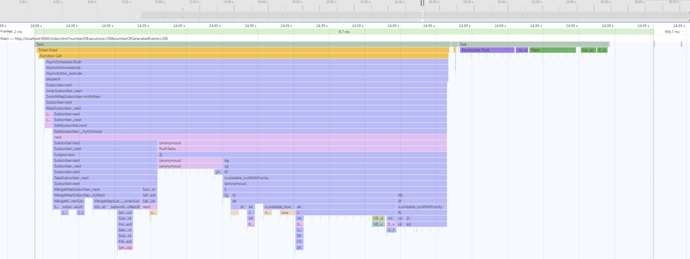
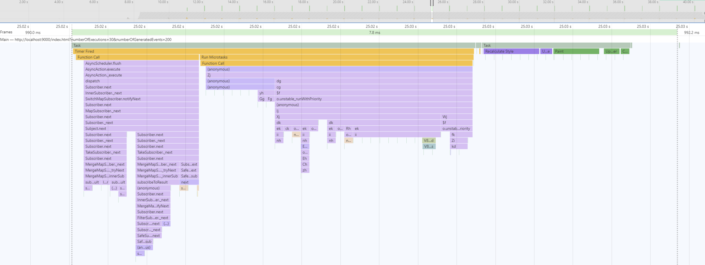
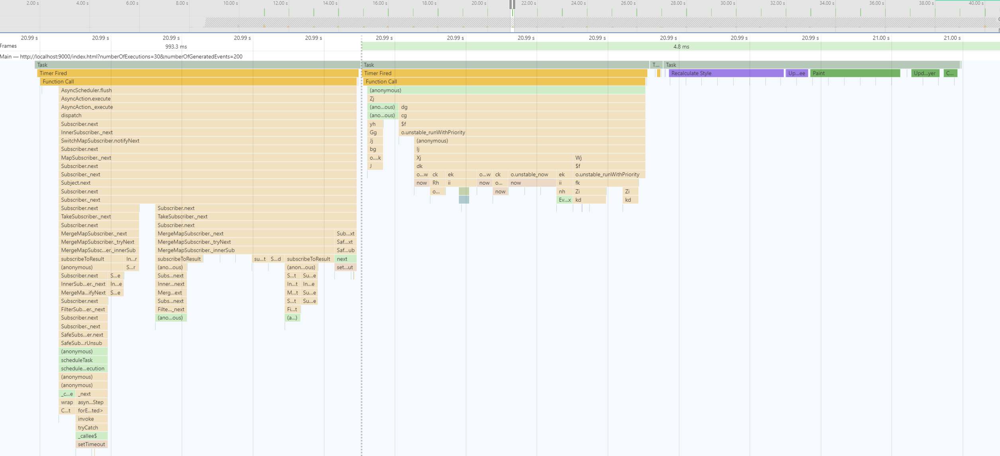
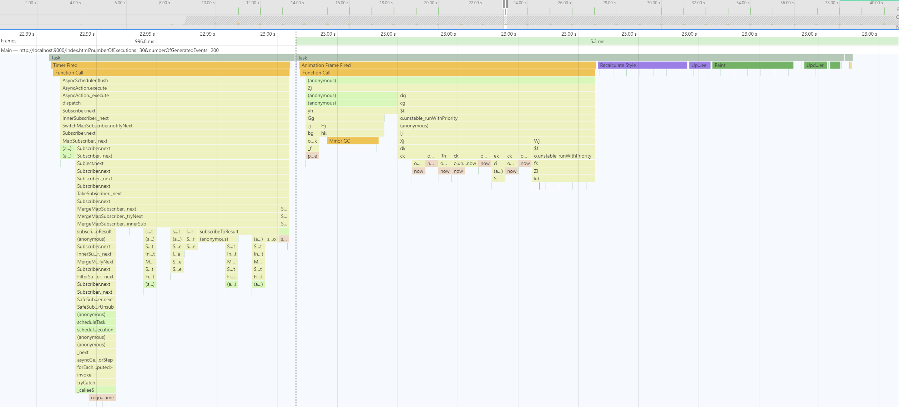

<div align="center">

# react-scheduling-experiment

Using custom scheduling in **[React](https://github.com/facebook/react)**.

</div>

<br><br><br>

## Scheduling in React

### Automatic scheduling in React

Within scopes known to React - such as a `useEffect()` hook body or an event handler function - all synchronous function calls that
manipulate state (using the `useState()` hook) will be batched up automatically, thus leading to only a single scheduled re-render instead
of potentially multiple ones. [[1](https://reactjs.org/docs/faq-state.html#when-is-setstate-asynchronous),
[2](https://overreacted.io/react-as-a-ui-runtime/),
[3](https://github.com/facebook/react/issues/16387#issuecomment-521623662)]

For instance:

```ts
// State
const [value, setValue] = useState('');
const [otherValue, setOtherValue] = useState('');
const [thisValue, setThisValue] = useState('');
const [thatValue, setThatValue] = useState('');

// Side effects
useEffect(() => {
  setOtherValue(`other ${value}.`);
  setThisValue(`this ${value}.`);
  setThatValue(`that ${value}.`);
}, [value]);
```

Let's assume we update the value, e.g. within an event handler. For instance:

```ts
setValue('cool value');
```

Now, the following re-renderings happen:

<table>
  <thead>
    <tr>
      <th>Render</th>
      <th>Description</th>
    </tr>
  </thead>
  <tbody>
    <tr>
      <td style="vertical-align: top">1</td>
      <td style="vertical-align: top">
        Calling <code>setValue('cool value')</code> will lead to the <code>value</code> state variable being updated by the
        <code>useState()</code> hook. Because updating state via the <code>useState()</code> hook will always trigger a re-render - at least
        if the value has actually changed, which in our case it did - React triggers a re-render.
      </td>
    </tr>
    <tr>
      <td style="vertical-align: top">2</td>
      <td style="vertical-align: top">
        Our <code>useEffect()</code> hook lists the <code>value</code> state variable as a dependency. Thus, changing the <code>value</code>
        state variable value will always lead to the <code>useEffect()</code> hook being executed. Within our <code>useEffect()</code> hook,
        we update three other state variables (again, based on `useState()`). Now: React has enough context for optimization: It knows what
        <code>useEffect()</code> is and does, and it has full control over / executes <code>useEffect()</code>. Thus, React intelligently
        batches up all three state changes instead of executing them directly, thus scheduling a single re-render instead of three separate
        ones.
      </td>
    </tr>
  </tbody>
</table>

<br>

### No automatic scheduling in asynchronous `useEffect()`s / event handlers

Now, things are different when asynchronous operations (e.g. promises, timeouts, RxJS, ...) come into play.

For instance:

```ts
// State
const [value, setValue] = useState('');
const [otherValue, setOtherValue] = useState('');
const [thisValue, setThisValue] = useState('');
const [thatValue, setThatValue] = useState('');

// Side effects
useEffect(() => {
  Promise.resolve().then(() => {
    setOtherValue(`other ${value}.`);
    setThisValue(`this ${value}.`);
    setThatValue(`that ${value}.`);
  });
}, [value]);
```

Let's assume we update the value, e.g. within an event handler. For instance:

```ts
setValue('cool value');
```

Now, the following re-renderings happen:

<table>
  <thead>
    <tr>
      <th>Render</th>
      <th>Description</th>
    </tr>
  </thead>
  <tbody>
    <tr>
      <td style="vertical-align: top">1</td>
      <td style="vertical-align: top">
        Calling <code>setValue('cool value')</code> will lead to the <code>value</code> state variable being updated by the
        <code>useState()</code> hook. Because updating state via the <code>useState()</code> hook will always trigger a re-render - at least
        if the value has actually changed, which in our case it did - React triggers a re-render.
      </td>
    </tr>
    <tr>
      <td style="vertical-align: top">2, 3, 4</td>
      <td style="vertical-align: top">
        Our <code>useEffect()</code> hook lists the <code>value</code> state variable as a dependency. Thus, changing the <code>value</code>
        state variable value will always lead to the <code>useEffect()</code> hook being executed. Within our <code>useEffect()</code> hook,
        we update three other state variables (again, based on <code>useState()</code>) once our promise resolves. Now: Due to our side
        effects being executed asynchronously (once the promise resolves), React does no longer have enough context for optimizations. Thus,
        in order to ensure that nothing breaks, React has no other choice than executing all state changes as per usual, leading to three
        separate re-renders.
      </td>
    </tr>
  </tbody>
</table>

<br>

### No automatic scheduling across chained `useEffect()`s

Also: Automatic batching / scheduling only works within each `useEffect()` body, not across multiple `useEffect()`s. If you have side
effects leading to new state that then triggers side effects - basically a chain of `useEffects()` - React is not able to optimize this as
it is too unpredicable.

For instance:

```ts
// State
const [value, setValue] = useState('');
const [otherValue, setOtherValue] = useState('');
const [thisValue, setThisValue] = useState('');

// Side effects
useEffect(() => {
  setOtherValue(`other ${value}.`);
}, [value]);
useEffect(() => {
  setThisValue(`this ${value}.`);
}, [otherValue]);
```

Let's assume we update the value, e.g. within an event handler. For instance:

```ts
setValue('cool value');
```

Now, the following re-renderings happen:

<table>
  <thead>
    <tr>
      <th>Render</th>
      <th>Description</th>
    </tr>
  </thead>
  <tbody>
    <tr>
      <td style="vertical-align: top">1</td>
      <td style="vertical-align: top">
        Calling <code>setValue('cool value')</code> will lead to the <code>value</code> state variable being updated by the
        <code>useState()</code> hook. Because updating state via the <code>useState()</code> hook will always trigger a re-render - at least
        if the value has actually changed, which in our case it did - React triggers a re-render.
      </td>
    </tr>
    <tr>
      <td style="vertical-align: top">2</td>
      <td style="vertical-align: top">
        Our first <code>useEffect()</code> hook lists the <code>value</code> state variable as a dependency. Thus, changing the
        <code>value</code> state variable value will always lead to the <code>useEffect()</code> hook being executed. Within our
        <code>useEffect()</code> hook, we update the <code>otherValue</code> state variables (again, based on <code>useState()</code>). This
        will lead to a re-render.
      </td>
    </tr>
    <tr>
      <td style="vertical-align: top">3</td>
      <td style="vertical-align: top">
        Our second <code>useEffect()</code> hook has the <code>otherValue</code> state variable as its dependency. Thus, the first
        <code>useEffect()</code> changing the <code>otherValue</code> state variable value will always lead to the second
        <code>useEffect()</code> hook being executed. Within our  second <code>useEffect()</code> hook, we update the other two state
        variables (again, based on `useState()`). This will, again, lead to a re-render.
      </td>
    </tr>
  </tbody>
</table>

<br>

### No automatic scheduling ouside of React scopes (e.g. RxJS)

When managing and distributing state outside of scopes known to React, e.g. when using [RxJS](https://github.com/ReactiveX/rxjs) (instead of
a React Context), React has no way of knowing how to optimize here. Even though the original data source (here our Observable) only emits
data once - at the same time, to all components subscribed to it - React will re-render every single component separately.

For instance:

```tsx
const [value, setValue] = useState('');
const dataStream = useMyObservable();

useEffect(() => {
  // Update value when it changes
  const subscription = dataStream.subscribe((newValue) => {
    setValue(newValue);
  });

  // Cleanup
  return () => {
    subscription.unsubscribe();
  };
});
```

<br><br><br>

## Manual scheduling in React

React itself (like many frontend frameworks) hides most of its implementation details and low-level APIs from us, so that we can concentrate
on building applications rather than deep diving into React internals. This also applies to the render pipeline and its scheduling
mechanisms.

<br>

### The `unstable_batchedUpdates` API

Luckily for us, though, React actually does expose _one_ API that enables us to group / batch renderings: `unstable_batchedUpdates`.

However, this API, like a few others React exposes, is prefixed with `unstable` - meaning it this AP not part of the public
React API and thus might change or even break with any future release. But, the `unstable_batchedUpdates` API is the most "stable unstable"
React APIs out there (see [this tweet](https://twitter.com/dan_abramov/status/1103399900371447819)), and many popular projects rely upon it
(e.g. [React Redux](https://react-redux.js.org/api/batch)). So it's pretty safe to use.

So, it's pretty safe to use? For now, yes. Should it get removed at some point (e.g. React 17) we just need to remove the
`unstable_batchedUpdates` optimzations and - while performance might worsen - our code continues to work just fine. With the upcoming
[Concurrent Mode](https://reactjs.org/docs/concurrent-mode-intro.html), chances are good that the `unstable_batchedUpdates` API might
actually become useless anyways as React will be intelligent enough to do most of the optimizations on its own. Until then,
`unstable_batchedUpdates` is the way to go.

<br>

### Scheduling synchronously, within a component

In the rather simple use cases, we can use `unstable_batchedUpdates` right away. A common scenario is running asynchronous code in a
`useEffect()` hook, and in that situation we can wrap all state change function calls in a single `unstable_batchedUpdates`. This scheduling
is synchronous, as React will render changes right away instead of sometimes later in the current task.

For instance:

```diff
  useEffect(() => {
    Promise.resolve().then(() => {
+     unstable_batchedUpdates(() => {
        setOtherValue(`other ${value}.`);
        setThisValue(`this ${value}.`);
        setThatValue(`that ${value}.`);
+     });
    });
  }, [value]);
```

#### Alternative: Combined state

Sometimes, for example if all state lives in the same component, it's just easier to combine multiple `useState()`s into a single
`useState()`, e.g. by combining state into an object.

For instance:

```diff
  useEffect(() => {
    Promise.resolve().then(() => {
+     unstable_batchedUpdates(() => {
-       setOtherValue(`other ${value}.`);
-       setThisValue(`this ${value}.`);
-       setThatValue(`that ${value}.`);
+       setAdditionalValues({
+         otherValue: `other ${value}.`,
+         thisValue: `this ${value}.`,
+         thatValue: `that ${value}.`
+       });
+     });
    });
  }, [value]);
```

<br>

### Scheduling synchronously / asynchronously, across components (render scheduler)

In more complex situations - e.g. when we want to schedule renderings across multiple components, perhaps even across multiple state
changes - we need to be a bit more creative. A custom scheduling solution could exist globally, allowing every component to schedule state
changes, and then either we (synchronously) or the browser (asynchronously) will run the state changes wrapped in `unstable_batchedUpdates`.

> The performance analysis below explores those custom scheduling solutions, and if / how they affect performance.

<br><br><br>

## Performance Analysis Setup & Implementation

### Test setup

Of course, we want to get meaningful and consistent results when performance analysis each use case implementation. The following has been
done to ensure this:

- **All use case implementations are completely separated from each other.**
  <br>
  Sure, it's a lot of duplicate code and tons of storage used by `node_modules` folders, but it keeps things clean. In particular:
  - Each use case implementation exists within a separete folder, and no code gets shared between use cases. This way, we can ensure that
    the implementation is kept to the absolute minimum, e.g. only the relevant scheduler, no unnecessary logic or "pages".
  - Each use case defines and installs its own dependencies, and thus has its own `node_modules` folder. This way, we can easily run our
    performance analysis tests using different dependencies per use case, e.g. using a newer / experimental version of React.
- **Performance analysis happens on a production build of the application.**
  <br>
  That's the version our users will see, so that's the version we should test. In particular:
  - Production builds might perform better (or at least different) than development builds due things like tree shaking, dead code
    elimination and minification.
  - React itself actually does additional things in development mode that do affect performance, e.g.
    [running additional checks or showing development warnings](https://reactjs.org/docs/optimizing-performance.html#use-the-production-build).
- **Performance analysis happens with the exact same clean browser.**
  <br>
  Let's keep variations to a minimum. In particular:
  - We use the exact same version of Chrome for all tests, ensuring consistent results.
  - We use a clean version of Chrome so that things like user profiles, settings or extensions / plugins don't affect the results.

While all this certainly helps getting solid test results, there will always be things out of our control, such as:

- Browser stuff (e.g. garbage collection, any internal delays)
- Software stuff (Windows, software running in the background)
- Hardware stuff (CPU, GPU, RAM, storage)

All the performance profiling results documented below ran on the following system:

| Area             | Details                                               |
| ---------------- | ----------------------------------------------------- |
| CPU              | Intel Core i7 8700K 6x 3.70Ghz                        |
| RAM              | 32GB DDR4-3200 DIMM CL16                              |
| GPU              | NVIDIA GeForce GTX 1070 8GB                           |
| Storage          | System: 512GB NVMe M.2 SSD, Project: 2TB 7.200rpm HDD |
| Operating System | Windows 10 Pro, Version 1909, Build 18363.778         |

<br>

### Test implementation

Within each test case implementation, the `start-analysis.bin.ts` script is responsible for executing the performance analysis and writing
the results onto the disk.

In particular, it follows these steps:

| Step | Description                                                                 |
| ---- | --------------------------------------------------------------------------- |
| 1    | Start the server that serves the frontend application build locally         |
| 2    | Start the browser, and navigate to the URL serving the frontend application |
| 3    | Start the browser performance profiler recording                            |
| -    | Wait for the test to finish                                                 |
| 4    | Stop the browser performance profiler recording                             |
| 5    | Write results to disk                                                       |
| 6    | Close browser                                                               |
| 7    | Close server                                                                |

> Internally, we use [Puppeteer](https://github.com/puppeteer/puppeteer) to control a browser, and use the native NodeJS server API to serve
> the fronted to that browser.

<br>

### How to run a test

To run a performance analysis on a use case, follow these steps:

1. Install dependencies by running `npm run install`
2. Create a production build by running `npm run build`
3. Run the performance analysis by running `npm run start:analysis`

The script will create the following two files within the `results` folder:

- `profiler-logs.json` contains the React profiler results
  <br>
  The root project is a React app that offers a visualization of this file in the form of charts. Simply run `npm start` and select a
  `profiler-logs.json` file.
- `tracing-profile.json` contains the browser performance tracing timeline
  <br>
  This file can be loaded into the "Performance" tab of the Chrome Dev Tools, or can be uploaded to and viewed online using the
  [DevTools Timeline Viewer](https://chromedevtools.github.io/timeline-viewer/)

<br><br><br>

## Performance Analysis

### Summary

#### Test parameters

We are running the performance analysis with the following parameters:

- We render once every second
- We render 200 components
- We render 30 times

#### Test results (summary)

The following table shows a short test summary. See further chapters for more details.

| Test case                                                                                                           | Average Render time | Comparison      |
| ------------------------------------------------------------------------------------------------------------------- | ------------------- | --------------- |
| [No scheduling](#test-case-no-scheduling)                                                                           | 9.69ms              | 100% (baseline) |
| [Synchronous scheduling by manual flush](#test-case-synchronous-scheduling-by-manual-flush)                         | 1.88ms              | 19.40%          |
| [Asynchronous scheduling using Microtasks](#test-case-asynchronous-scheduling-using-microtasks)                     | 1.81ms              | 18.68%          |
| [Asynchronous scheduling using Macrotasks](##test-case-asynchronous-scheduling-using-macrotasks)                    | 1.84ms              | 18.99%          |
| [Asynchronous scheduling using based on render cycle](#test-case-asynchronous-scheduling-based-on-the-render-cycle) | 1.84ms              | 18.99%          |
| [Concurrent Mode (experimental!)](#bonus-concurrent-mode-experimental)                                              | 1.85ms              | 19.09%          |

#### Interpretation of results

- Using scheduling (either manually or by switching to Concurrent Mode) generally improves render speeds by a factor of 5.
- There is not identifyable difference between different render scheduler mechanisms in regards to the render speed. Thus, the decision on
  which scheduling technique to use just depends on the specific use case. Different scheduling mechanisms may even be combined if useful.

#### Recommendations

- **Concurrent Mode is not yet ready**
  <br>
  Ideally, we want to use features that come with React itself. But as the React Concurrent Mode is still very experimental and requires the
  App to be stict-mode compatible (which many popular and widely used React libraries are still not yet), it's not a solution for most
  apps and people (except maybe for people like me who like to live on the edge and break things all the freakin' time).
- **Synchronous scheduling is doable but not easy**
  <br>
  [Synchronous scheduling by manual flush](#test-case-synchronous-scheduling-by-manual-flush) comes the closest to
  [not using scheduling](#test-case-no-scheduling), but it requires us to handle the flush by ourselves, probably at the place where state
  gets managed - seems that this is not the best idea from an architecture point of view?
- **Asynchronous scheduling is the easiest solution**
  <br>
  [Asynchronous scheduling using Microtasks](#test-case-asynchronous-scheduling-using-microtasks) is probably the easiest and most stable
  solution. Other asynchronous scheduling techniques may be used depending on the specific use case.

<br>

### Test case: No scheduling

This test case shows how performance takes a hit when state is managed and propagated to components outside of scopes known to React, here
by [RxJS](https://github.com/ReactiveX/rxjs) observables. React will re-render each component separately.

The test results of this scenario represent the baseline for any further performance improvements.

#### Timeline

The following chart shows how each state change leads a render step (re-rendering all components) that consists of multiple updates
(re-rendering one component).


#### Update durations (one component)

A single update (one component re-renders) is very quick (about 0.05ms).


#### Render durations (all components)

Although each single update (one component re-renders) is very quick, running all those updates separetely - with React being unable to
optimize across those updates - takes time. On average, we are talking about _9.5ms_ to _10ms_, which is way too much when considering a
common frame budget (_16.66ms_).


#### Tracing

Wow, that is one busy tracing profile! We can see lots of fragmentation, the lower parts representing the function calls of React re-rendering components separately.


<br>

### Test case: Synchronous scheduling by manual flush

In this test case, we schedule state changes instead of executing them right away, and then flush them manually (batched up) once all state
changes are propagated to components. In particular, we flush all tasks after every observable subscriber has processed the new value.

> Implementation pointers:
>
> - [Render scheduler](https://github.com/dominique-mueller/react-scheduling-experiment/blob/master/packages/scheduler-sync/src/RenderScheduler.ts#L6)
> - [Scheduling tasks](https://github.com/dominique-mueller/react-scheduling-experiment/blob/master/packages/scheduler-sync/src/EventBox.tsx#L29)
> - [Flushing tasks synchronously](https://github.com/dominique-mueller/react-scheduling-experiment/blob/master/packages/scheduler-sync/src/event-stream.ts#L63)

#### Timeline

The following chart shows that now each render step (re-rendering all components) contains only one update that now re-renders all
components at once instead of separately.


#### Update & render durations (all components)

A single update equals a single render. On average, all component re-render at _1.8ms_ to _1.9ms_ time, which breaks down to a theoratical
component re-render time of _0.01ms_.


#### Tracing

This tracing profile looks very clean, very few function calls compared to the not-scheduled test case.Everything is executed within one synchronous block of code, even scheduled renderings.



<br>

### Test case: Asynchronous scheduling using Microtasks

In this test case, we schedule state changes instead of executing them right away in the form of Microtasks, meaning that the browser will
automatically flush all tasks once the currently running synchronous code has been completed and previsouly scheduled Microtasks have been
executed.

In order to schedule a Microtask, we use the
[`queueMicrotask()`](https://developer.mozilla.org/en-US/docs/Web/API/WindowOrWorkerGlobalScope/queueMicrotask) API:

```ts
queueMicrotask(callbackFn);
```

As a fallback / polyfill (e.g. for older browsers), we could also use
[Promises](https://developer.mozilla.org/en-US/docs/Web/JavaScript/Reference/Global_Objects/Promise/resolve) to schedule a Microtask:

```ts
Promise.resolve().then(callbackFn);
```

> Implementation pointers:
>
> - [Render scheduler](https://github.com/dominique-mueller/react-scheduling-experiment/blob/master/packages/scheduler-microtask/src/RenderScheduler.ts#L6)
> - [Scheduling tasks](https://github.com/dominique-mueller/react-scheduling-experiment/blob/master/packages/scheduler-microtask/src/EventBox.tsx#L29)

#### Timeline

The following chart shows that now each render step (re-rendering all components) contains only one update that now re-renders all
components at once instead of separately.


#### Update & render durations (all components)

A single update equals a single render. On average, all component re-render at _1.8ms_ to _1.9ms_ time, which breaks down to a theoratical
component re-render time of _0.01ms_.


#### Tracing

This tracing profile looks very clean, very few function calls compared to the not-scheduled test case. Everything is executed within the same Macrotask, the first synchronous block containing the state change and its propagation to the components, the second Microtask block being the execution of all scheduled renderings right after.



<br>

### Test case: Asynchronous scheduling using Macrotasks

In this test case, we schedule state changes instead of executing them right away in the form of Macrotasks, meaning that the browser will
automatically flush all tasks once the currently running synchronous code has been completed and all scheduled Microtasks have been
executed. It's important to note that the browser might render an update on screen before our scheduled code executes.

In order to schedule a Macrotask, we use the
[`setTimeout()`](https://developer.mozilla.org/en-US/docs/Web/API/WindowOrWorkerGlobalScope/setTimeout) API with a timeout of zero:

```ts
setTimeout(callbackFn, 0);
```

> Implementation pointers:
>
> - [Render scheduler](https://github.com/dominique-mueller/react-scheduling-experiment/blob/master/packages/scheduler-macrotask/src/RenderScheduler.ts#L6)
> - [Scheduling tasks](https://github.com/dominique-mueller/react-scheduling-experiment/blob/master/packages/scheduler-macrotask/src/EventBox.tsx#L29)

#### Timeline

The following chart shows that now each render step (re-rendering all components) contains only one update that now re-renders all
components at once instead of separately.


#### Update & render durations (all components)

A single update equals a single render. On average, all component re-render at _1.8ms_ to _1.9ms_ time, which breaks down to a theoratical
component re-render time of _0.01ms_.


#### Tracing

This tracing profile looks very clean, very few function calls compared to the not-scheduled test case. The first Macrotask contains the state change and its propagation to the components, the second Macrotask runs all scheduled renderings. We can also clearly see how the browser decided to render a frame in between, which might happen when using Macrotasks for scheduling purposes.



<br>

### Test case: Asynchronous scheduling based on the render cycle

In this test case, we schedule state changes instead of executing them right away by deffering them to the render cycle, meaning that the
browser will automatically flush all tasks right before it renders on screen.

In order to schedule based on the render cycle, we use the
[`requestAnimationFrame()`](https://developer.mozilla.org/en-US/docs/Web/API/window/requestAnimationFrame) API:

```ts
requestAnimationFrame(callbackFn);
```

> Implementation pointers:
>
> - [Render scheduler](https://github.com/dominique-mueller/react-scheduling-experiment/blob/master/packages/scheduler-render-cycle/src/RenderScheduler.ts#L6)
> - [Scheduling tasks](https://github.com/dominique-mueller/react-scheduling-experiment/blob/master/packages/scheduler-render-cycle/src/EventBox.tsx#L29)

#### Timeline

The following chart shows that now each render step (re-rendering all components) contains only one update that now re-renders all
components at once instead of separately.


#### Update & render durations (all components)

A single update equals a single render. On average, all component re-render at _1.8ms_ to _1.9ms_ time, which breaks down to a theoratical
component re-render time of _0.01ms_.


#### Tracing

This tracing profile looks very clean, very few function calls compared to the not-scheduled test case. The first Macrotask contains the state change and its propagation to the components, the second block runs all scheduled renderings right before the browser renders on screen.



<br>

### Bonus: Concurrent Mode (experimental!)

Bonus time: Let's test that fancy cool new [React concurrent mode](https://reactjs.org/docs/concurrent-mode-intro.html). Here, we don't have
a manual scheduler in place. Instead, we use the new `ReactDOM.createRoot()` function to instantiate our application, thus enabling
concurrent mode, and otherwhise develop our application like we are used to.

> Note: React concurrent mode is still highly experimental, and requires the application to run properly in strict mode!

#### Timeline

The following chart shows that now each render step (re-rendering all components) contains only one update that now re-renders all
components at once instead of separately.


#### Update & render durations (all components)

A single update equals a single render. On average, all component re-render at _1.8ms_ to _1.9ms_ time, which breaks down to a theoratical
component re-render time of _0.01ms_.


#### Tracing

This tracing profile looks very clean, very few function calls compared to the not-scheduled test case. The first Macrotask contains the state change and its propagation to the components. It seems that the React Concurrent Mode decided to schedule re-renderings into a separate Macrotask, using `setTimeout(callbackFn, 0)` - interesting!


